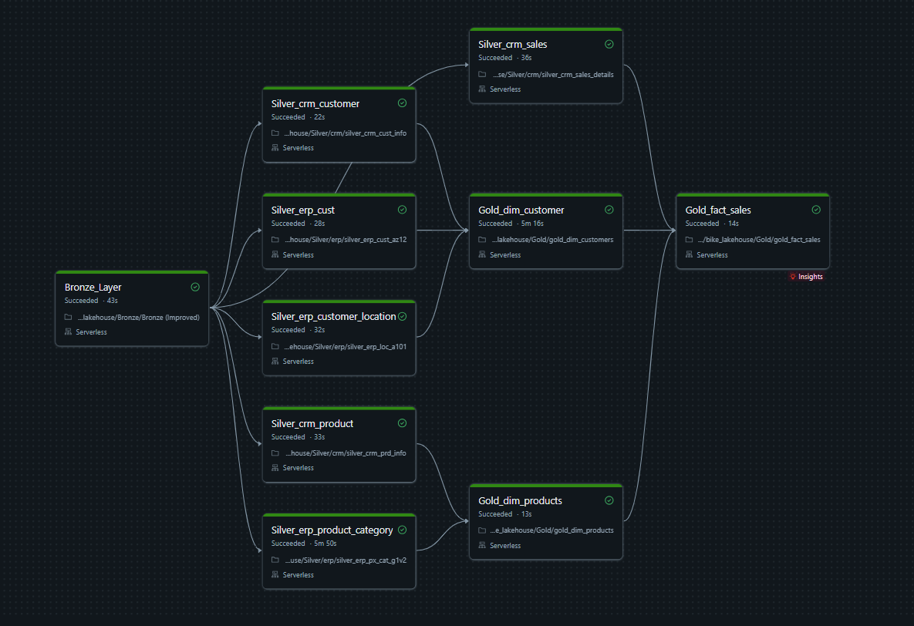
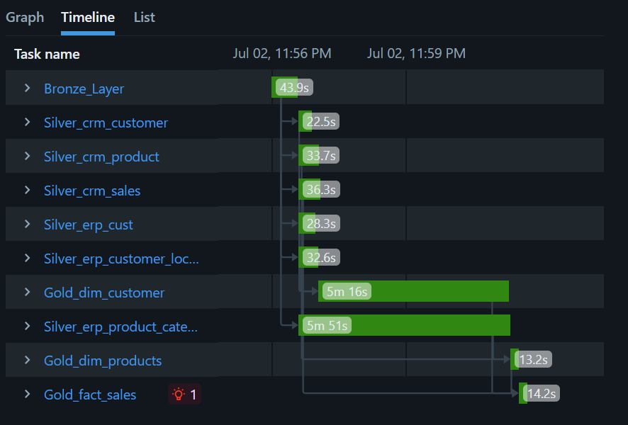

# End-to-End Medallion Data Pipeline in Databricks

## 📌 Project Overview
The Project demonstrates a production-grade data pipeline utilizing the **Medallion Architecture (Bronze, Silver, Gold)** within Databricks. It ingests raw CSV data from CRM(Customer Relationship Management) and ERP(Enterprise Resource Planning) systems, performs data cleaning and transformations using PySpark, and models the final data into a Kimball-style Star Schema for business intelligence and analytics.

## 🛠️ Tech Stack & Tools
* **Platform:** Databricks
* **Languages:** Python (PySpark), Spark SQL
* **Data Governance:** Unity Catalog
* **Storage:** Databricks Volumes, Delta Lake
* **Orchestration:** Databricks Jobs and Pipelines (Notebook Orchestration also present but execution is serial instead of Parallel)

## 🏗️ Architecture & Data Flow

### 1. Data Ingestion (Volumes)
* Raw data consists of 6 CSV files (3 CRM, 3 ERP) representing customer, product, and sales data.
* Files are stored in Databricks Volumes.

### 2. 🥉 Bronze Layer (Raw Data)
* **Objective:** Create an immutable, historical archive of the source data (1:1 Copy of the raw data).
* **Process:** Data is ingested from the Volumes into the Unity Catalog (`databricks_medallion_pipeline.bronze`) as Delta tables.
* **Result:** 6 Bronze tables representing a 1:1 copy of the source CSVs with no transformations applied.

### 3. 🥈 Silver Layer (Cleansed & Conformed)
* **Objective:** Clean, filter, and standardize the data for downstream processing.
* **Process:** Built using PySpark and Spark SQL to perform data quality checks.
* **Transformations Applied:**
  * Trimmed whitespace from string columns.
  * Standardized and renamed columns for consistency across CRM and ERP systems.
  * Handled `NULL` values and cast data types appropriately.
* **Result:** 6 cleansed Silver tables ready for dimensional modeling.

### 4. 🥇 Gold Layer (Business Logic)
* **Objective:** Deliver query-optimized data for business analysts and BI tools.
* **Process:** Joined the independent Silver tables (CRM and ERP) to resolve entity overlap and generate surrogate keys.
* **Result:** A fully functional Star Schema consisting of:
  * `dim_customers`: Unified customer dimension.
  * `dim_products`: Unified product dimension.
  * `fact_sales`: Central fact table capturing all transactional metrics and foreign keys.

## ⚙️ Orchestration & Scheduling
The pipeline is fully automated using **Databricks Jobs and Pipelines**. Independent Silver layer transformations run in parallel to optimize cluster compute time, while dependency triggers ensure the Gold layer only executes upon successful completion of upstream tasks.

### Directed Acyclic Graph (DAG)

### Execution Timeline

